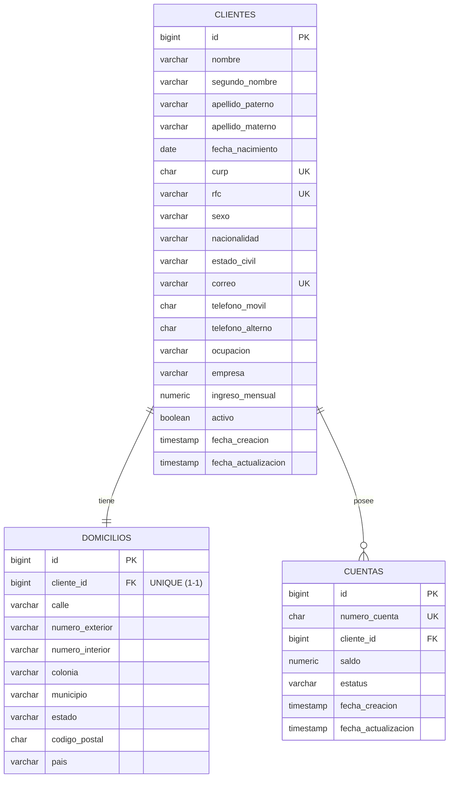

# Diagrama Entidad-Relacion

```mermaid
erDiagram
    CLIENTES ||--|| DOMICILIOS : tiene
    CLIENTES ||--o{ CUENTAS : posee

    CLIENTES {
        bigint id PK
        varchar nombre
        varchar segundo_nombre
        varchar apellido_paterno
        varchar apellido_materno
        date fecha_nacimiento
        char curp UK
        varchar rfc UK
        varchar sexo
        varchar nacionalidad
        varchar estado_civil
        varchar correo UK
        char telefono_movil
        char telefono_alterno
        varchar ocupacion
        varchar empresa
        numeric ingreso_mensual
        boolean activo
        timestamp fecha_creacion
        timestamp fecha_actualizacion
    }
    DOMICILIOS {
        bigint id PK
        bigint cliente_id FK "UNIQUE (1-1)"
        varchar calle
        varchar numero_exterior
        varchar numero_interior
        varchar colonia
        varchar municipio
        varchar estado
        char codigo_postal
        varchar pais
    }
    CUENTAS {
        bigint id PK
        char numero_cuenta UK
        bigint cliente_id FK
        numeric saldo
        varchar estatus
        timestamp fecha_creacion
        timestamp fecha_actualizacion
    }
```

Relaciones:
- Cliente (1) -- (1) Domicilio  -> FK unica cliente_id en domicilios
- Cliente (1) -- (N) Cuenta      -> FK cliente_id en cuentas
