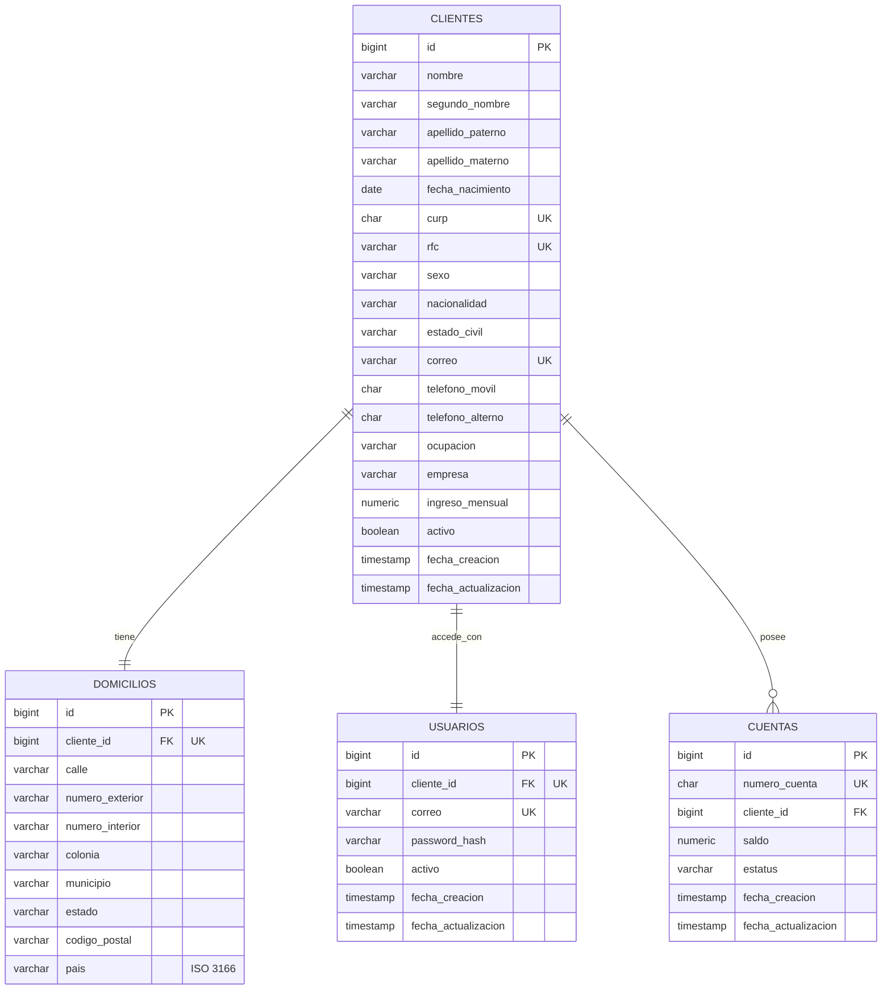

# Proyecto Integrador — Onboarding de Clientes Personas Físicas

Documento de entrega. Reúne los entregables solicitados: documento técnico, diagrama entidad-relación, script de base de datos y guía de endpoints con payloads de prueba.

- **Swagger UI (local):** `http://localhost:8081/swagger-ui.html`
- **Swagger UI (Render):** `https://gestopagos-api.onrender.com/swagger-ui.html`
- **Prefijo de la API:** todos los endpoints de negocio viven bajo `/api/v1`.

---

# 1. Documento Técnico

## Objetivo
API REST que registra clientes persona física, valida su información y, de forma automática, les crea una cuenta bancaria y un usuario de acceso, con autenticación por JWT.

## Tecnologías
Java 21 · Spring Boot 3.3 · Spring Data JPA / Hibernate · PostgreSQL · Flyway · Bean Validation · Spring Security (BCrypt) · JWT (HS256) · OpenAPI/Swagger.

## Arquitectura
Capas: `controller` → `service` → `repository` → `entity`.
- **controller:** expone la API REST.
- **service:** lógica de negocio y transacciones.
- **repository:** acceso a datos (JPA).
- **entity:** mapeo objeto-relacional.
- **model:** DTOs de request/response (nunca se exponen entidades).
- **exception:** excepciones personalizadas + manejador global.
- **validation:** patrones y validadores (CURP, RFC, mayoría de edad, país ISO, domicilio).

## Reglas de negocio
- Cliente mayor de edad (18+).
- CURP, RFC y correo únicos.
- Teléfono de 10 dígitos; ingreso mensual > 0; saldo inicial ≥ 0.
- Número de cuenta único (10 dígitos, autogenerado).
- CURP, RFC y número de cuenta inmutables en la actualización.
- Solo clientes activos pueden tener cuentas activas.
- Password: mínimo 8, con mayúscula, minúscula, número y carácter especial (BCrypt).
- Correo único entre clientes y usuarios.

## Automatismos
- **Alta de cliente:** en una sola transacción se crea el cliente, su **cuenta** (ACTIVA, saldo inicial del sistema) y su **usuario** de acceso (correo del cliente, password cifrado).
- **Baja lógica del cliente:** el cliente queda inactivo, sus cuentas pasan a INACTIVA y su usuario se inactiva.
- **Cambio de correo del cliente:** se sincroniza con el usuario de acceso.

## Validaciones
- **Formato:** `@NotBlank`, `@Email`, `@Pattern` (CURP, RFC, teléfono, password), `@DecimalMin`, `@Size`.
- **Personalizadas:** mayoría de edad, país ISO 3166, domicilio condicional por país.
- **Código postal real:** se valida contra una API externa (zipcodestack, con respaldo zippopotam) con caché y tolerancia a fallos.
- **Blindaje de entradas:** recorte de espacios y normalización a mayúsculas de CURP, RFC y país.

## Autenticación
`POST /api/v1/auth/login` valida correo + password contra la tabla `usuarios`, verifica que el usuario esté activo y emite un JWT (HS256). El secreto y las credenciales sensibles se leen de variables de entorno, nunca del código.

---

# 2. Diagrama Entidad-Relación

Relaciones: Cliente **(1:1)** Domicilio · Cliente **(1:1)** Usuario · Cliente **(1:N)** Cuenta.



---

# 3. Script de Creación de Base de Datos

```sql
-- CLIENTES
CREATE TABLE clientes (
    id                   BIGINT        GENERATED ALWAYS AS IDENTITY PRIMARY KEY,
    nombre               VARCHAR(50)   NOT NULL,
    segundo_nombre       VARCHAR(50),
    apellido_paterno     VARCHAR(50)   NOT NULL,
    apellido_materno     VARCHAR(50)   NOT NULL,
    fecha_nacimiento     DATE          NOT NULL,
    curp                 CHAR(18)      NOT NULL,
    rfc                  VARCHAR(13)   NOT NULL,
    sexo                 VARCHAR(10)   NOT NULL,
    nacionalidad         VARCHAR(50)   NOT NULL,
    estado_civil         VARCHAR(15)   NOT NULL,
    correo               VARCHAR(100)  NOT NULL,
    telefono_movil       CHAR(10)      NOT NULL,
    telefono_alterno     CHAR(10),
    ocupacion            VARCHAR(100)  NOT NULL,
    empresa              VARCHAR(100)  NOT NULL,
    ingreso_mensual      NUMERIC(14,2) NOT NULL,
    activo               BOOLEAN       NOT NULL DEFAULT TRUE,
    fecha_creacion       TIMESTAMP     NOT NULL DEFAULT NOW(),
    fecha_actualizacion  TIMESTAMP     NOT NULL DEFAULT NOW(),
    CONSTRAINT uq_clientes_curp   UNIQUE (curp),
    CONSTRAINT uq_clientes_rfc    UNIQUE (rfc),
    CONSTRAINT uq_clientes_correo UNIQUE (correo),
    CONSTRAINT ck_clientes_sexo         CHECK (sexo IN ('MASCULINO','FEMENINO','OTRO')),
    CONSTRAINT ck_clientes_estado_civil CHECK (estado_civil IN ('SOLTERO','CASADO','DIVORCIADO','VIUDO','UNION_LIBRE')),
    CONSTRAINT ck_clientes_telefono     CHECK (telefono_movil ~ '^[0-9]{10}$'),
    CONSTRAINT ck_clientes_ingreso      CHECK (ingreso_mensual > 0)
);
CREATE INDEX idx_clientes_apellidos  ON clientes (apellido_paterno, apellido_materno);
CREATE INDEX idx_clientes_nombre     ON clientes (nombre);
CREATE INDEX idx_clientes_fecha_alta ON clientes (fecha_creacion);

-- DOMICILIOS (1:1 con cliente; CP hasta 10, país ISO 3166; CP de 5 dígitos solo para MX)
CREATE TABLE domicilios (
    id               BIGINT        GENERATED ALWAYS AS IDENTITY PRIMARY KEY,
    cliente_id       BIGINT        NOT NULL,
    calle            VARCHAR(100)  NOT NULL,
    numero_exterior  VARCHAR(10)   NOT NULL,
    numero_interior  VARCHAR(10),
    colonia          VARCHAR(100)  NOT NULL,
    municipio        VARCHAR(100)  NOT NULL,
    estado           VARCHAR(100),
    codigo_postal    VARCHAR(10)   NOT NULL,
    pais             VARCHAR(2)    NOT NULL,
    CONSTRAINT fk_domicilios_cliente FOREIGN KEY (cliente_id) REFERENCES clientes (id),
    CONSTRAINT uq_domicilios_cliente UNIQUE (cliente_id),
    CONSTRAINT ck_domicilios_pais    CHECK (pais ~ '^[A-Z]{2}$'),
    CONSTRAINT ck_domicilios_cp      CHECK (UPPER(pais) <> 'MX' OR codigo_postal ~ '^[0-9]{5}$')
);

-- CUENTAS (1:N con cliente; número de 10 dígitos, único)
CREATE TABLE cuentas (
    id                   BIGINT        GENERATED ALWAYS AS IDENTITY PRIMARY KEY,
    numero_cuenta        CHAR(10)      NOT NULL,
    cliente_id           BIGINT        NOT NULL,
    saldo                NUMERIC(16,2) NOT NULL DEFAULT 0,
    estatus              VARCHAR(10)   NOT NULL DEFAULT 'ACTIVA',
    fecha_creacion       TIMESTAMP     NOT NULL DEFAULT NOW(),
    fecha_actualizacion  TIMESTAMP     NOT NULL DEFAULT NOW(),
    CONSTRAINT uq_cuentas_numero   UNIQUE (numero_cuenta),
    CONSTRAINT fk_cuentas_cliente  FOREIGN KEY (cliente_id) REFERENCES clientes (id),
    CONSTRAINT ck_cuentas_estatus  CHECK (estatus IN ('ACTIVA','INACTIVA')),
    CONSTRAINT ck_cuentas_saldo    CHECK (saldo >= 0)
);
CREATE INDEX idx_cuentas_cliente ON cuentas (cliente_id);
CREATE INDEX idx_cuentas_estatus ON cuentas (estatus);

-- USUARIOS (1:1 con cliente; correo = usuario; password BCrypt)
CREATE TABLE usuarios (
    id                   BIGINT        GENERATED ALWAYS AS IDENTITY PRIMARY KEY,
    cliente_id           BIGINT        NOT NULL,
    correo               VARCHAR(100)  NOT NULL,
    password_hash        VARCHAR(100)  NOT NULL,
    activo               BOOLEAN       NOT NULL DEFAULT TRUE,
    fecha_creacion       TIMESTAMP     NOT NULL DEFAULT NOW(),
    fecha_actualizacion  TIMESTAMP,
    CONSTRAINT uq_usuarios_correo  UNIQUE (correo),
    CONSTRAINT uq_usuarios_cliente UNIQUE (cliente_id),
    CONSTRAINT fk_usuarios_cliente FOREIGN KEY (cliente_id) REFERENCES clientes (id)
);
CREATE INDEX ix_usuarios_activo ON usuarios (activo);
```

---

# 4. Guía de Endpoints y Payloads

## Antes de probar
`POST /clientes` devuelve el **`id`** del cliente y el **`numeroCuenta`** (10 dígitos); varios endpoints los necesitan. Enumeraciones: **sexo** (`MASCULINO`·`FEMENINO`·`OTRO`), **estadoCivil** (`SOLTERO`·`CASADO`·`DIVORCIADO`·`VIUDO`·`UNION_LIBRE`), **estatus** de cuenta (`ACTIVA`·`INACTIVA`). País en ISO 3166 (`MX`, `US`).

### 1. POST /api/v1/clientes — Registro de cliente
Cubre: Registro + Cuenta automática + Usuario automático. Guarda el `id` y el `numeroCuenta`.
```json
{
  "nombre": "Maria",
  "segundoNombre": "Fernanda",
  "apellidoPaterno": "Garcia",
  "apellidoMaterno": "Lopez",
  "fechaNacimiento": "1988-03-15",
  "curp": "GALM880315MDFRPR07",
  "rfc": "GAFL880315AB1",
  "sexo": "FEMENINO",
  "nacionalidad": "Mexicana",
  "estadoCivil": "CASADO",
  "correo": "maria.garcia@correo.mx",
  "telefonoMovil": "5523456789",
  "telefonoAlterno": "5587654321",
  "ocupacion": "Contadora Publica",
  "empresa": "Despacho Fiscal Garcia y Asociados SC",
  "ingresoMensual": 42000.00,
  "password": "Secur3!Pass#2026",
  "domicilio": {
    "calle": "Av. Juarez",
    "numeroExterior": "350",
    "numeroInterior": "12A",
    "colonia": "Centro",
    "municipio": "Guanajuato",
    "estado": "GUANAJUATO",
    "codigoPostal": "36000",
    "pais": "MX"
  }
}
```
→ 201. Duplicado → 409; CP inexistente o password débil → 400.

### 2. POST /api/v1/auth/login — Inicio de sesión
Cubre: login + JWT.
```json
{
  "correo": "maria.garcia@correo.mx",
  "password": "Secur3!Pass#2026"
}
```
→ 200 `{ correo, tipo:"Bearer", token, emitidoEn, expiraEn, expiraEnSegundos }`. Credenciales malas o usuario inactivo → 401.

### 3. GET /api/v1/clientes — Consultar todos
```
GET /api/v1/clientes
```

### 4. GET /api/v1/clientes/{id} — Consultar por ID
```
GET /api/v1/clientes/1
```

### 5. GET /api/v1/clientes?curp={curp} — Buscar por CURP
```
GET /api/v1/clientes?curp=GALM880315MDFRPR07
```

### 6. GET /api/v1/clientes?rfc={rfc} — Buscar por RFC
```
GET /api/v1/clientes?rfc=GAFL880315AB1
```

### 7. GET /api/v1/clientes?correo={correo} — Buscar por correo
```
GET /api/v1/clientes?correo=maria.garcia@correo.mx
```

### 8. GET /api/v1/clientes?numeroCuenta={numeroCuenta} — Buscar por número de cuenta
Usa el `numeroCuenta` real del endpoint 1.
```
GET /api/v1/clientes?numeroCuenta=0481526379
```

### 9. GET /api/v1/clientes?nombre={nombre} — Buscar por nombre
```
GET /api/v1/clientes?nombre=Maria
```

### 10. GET /api/v1/clientes?apellidoPaterno={apellidoPaterno} — Buscar por apellido paterno
```
GET /api/v1/clientes?apellidoPaterno=Garcia
```

### 11. GET /api/v1/clientes?apellidoMaterno={apellidoMaterno} — Buscar por apellido materno
```
GET /api/v1/clientes?apellidoMaterno=Lopez
```

### 12. GET /api/v1/clientes?activo=true — Clientes activos
```
GET /api/v1/clientes?activo=true
```

### 13. GET /api/v1/clientes?desde={desde}&hasta={hasta} — Rango de fechas
```
GET /api/v1/clientes?desde=2026-01-01&hasta=2026-12-31
```

### 14. PATCH /api/v1/clientes/{id} — Actualización parcial
CURP, RFC y número de cuenta son inmutables. Si cambia el correo se sincroniza con el usuario; si se envía domicilio, se revalida el CP.
```json
{
  "telefonoMovil": "5566778899",
  "ocupacion": "Socia Directora",
  "ingresoMensual": 65000.00,
  "estadoCivil": "DIVORCIADO",
  "domicilio": {
    "calle": "Paseo de la Presa",
    "numeroExterior": "890",
    "colonia": "Centro",
    "municipio": "Leon",
    "estado": "GUANAJUATO",
    "codigoPostal": "37000",
    "pais": "MX"
  }
}
```
→ 200. Correo ya usado → 409; CP inexistente → 400; cliente inexistente → 404.

### 15. DELETE /api/v1/clientes/{id} — Baja lógica
No elimina datos: marca el cliente inactivo e inactiva sus cuentas y su usuario.
```
DELETE /api/v1/clientes/1
```
→ 204. Cliente inexistente → 404.

### 16. POST /api/v1/cuentas — Crear cuenta adicional
Solo clientes activos. `saldoInicial` opcional (default 0.00).
```json
{
  "clienteId": 1,
  "saldoInicial": 7500.50
}
```
→ 201. Cliente inexistente → 404; cliente inactivo → 409; saldo negativo → 400.

### 17. GET /api/v1/cuentas/{numeroCuenta} — Consultar cuenta por número
```
GET /api/v1/cuentas/0481526379
```

### 18. GET /api/v1/cuentas/{numeroCuenta}/saldo — Consultar saldo
```
GET /api/v1/cuentas/0481526379/saldo
```
→ 200 `{ numeroCuenta, saldo }`.

### 19. GET /api/v1/cuentas?clienteId={clienteId} — Cuentas por cliente
```
GET /api/v1/cuentas?clienteId=1
```

### 20. GET /api/v1/cuentas?estatus={estatus} — Cuentas por estatus
Sin parámetros, `GET /api/v1/cuentas` devuelve las activas.
```
GET /api/v1/cuentas?estatus=ACTIVA
```

### 21. PATCH /api/v1/cuentas/{numeroCuenta} — Actualizar estatus de cuenta
```json
{
  "estatus": "INACTIVA"
}
```
→ 200. Estatus inválido → 400; cuenta inexistente → 404.

### 22. GET /api/v1/usuarios/filtro?activo={activo} — Filtrar usuarios por estatus
Nunca expone el password. Sin `activo` devuelve todos.
```
GET /api/v1/usuarios/filtro?activo=true
```

### 23. PUT /api/v1/usuarios/{id}/estatus — Activar / inactivar usuario
```json
{
  "activo": false
}
```
→ 200. Usuario inexistente → 404; body sin `activo` → 400.

---

# 5. Catálogo de Errores

Formato uniforme de error:
```json
{
  "timestamp": "2026-10-09T12:00:00",
  "status": 400,
  "error": "Error de validacion",
  "mensajes": ["mensaje 1"],
  "path": "/api/v1/clientes"
}
```

| HTTP | Caso |
|---|---|
| 400 | Formato inválido, código postal inexistente, password que no cumple la política |
| 401 | Credenciales incorrectas o usuario inactivo (login) |
| 404 | Cliente / cuenta / usuario no encontrado |
| 409 | CURP / RFC / correo duplicado, o cliente inactivo |
| 500 | Error interno no controlado |